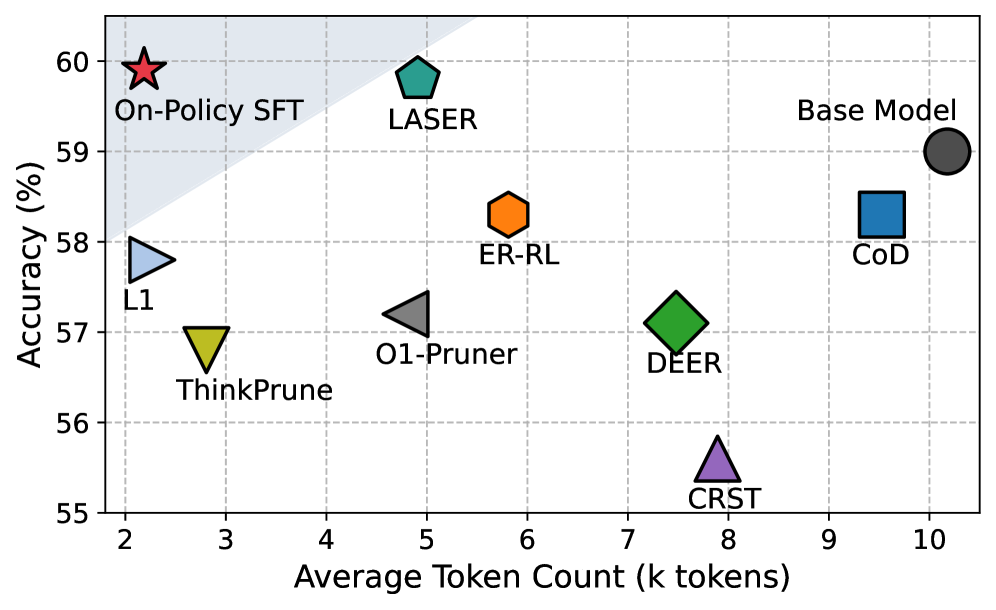
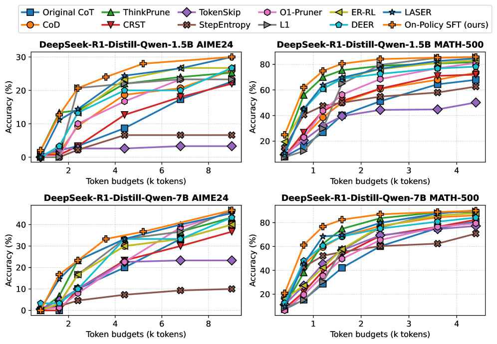

<table>
  <tr>
    <td style="width: 45%;"></td>
    <td style="width: 45%;"></td>
  </tr>
</table>

# On-Policy SFT

Code for [On-Policy Supervised Fine-Tuning for Efficient Reasoning](https://arxiv.org/abs/2602.13407).

> [!NOTE]
> This repository focuses on on-policy SFT training and validation updates built on top of VERL.

## Setup

```sh
git clone https://github.com/EIT-NLP/On-Policy-SFT
cd On-Policy-SFT/opsft

conda create -n opsft python=3.10
conda activate opsft

pip install -r requirements.txt
pip install flash_attn==2.7.4.post1 --no-build-isolation  # choose a suitable version for your own machine
pip install -e . --no-dependencies
```

> [!NOTE]
> Installation behavior can vary across different machines and CUDA environments. If needed, please adapt package versions accordingly.

## Run

Before running the script below, please ensure you are in the project root directory (`On-Policy-SFT/opsft`).

```sh
conda activate opsft

# for on-policy SFT training
bash examples/On_Policy_SFT.sh
```

### Validation on specific checkpoints

For evaluation, we re-write the evaluation code for `_validate` function inside the Trainer.

## Dataset

The datasets are located in `opsft/data` folder.
- Training sets: `deepscaler` (DSR), `OpenThoughts3-1.2M/math_question` (OpenThoughts math-only), and `gsm8k`.
- Benchmarks: benchmark files are located in `opsft/data/benchmarks`.

## What we mainly modified

### Training logic

- `recipe/On_Policy_SFT/on_policy_sft_trainer`: On-Policy SFT training logic.
- `recipe/On_Policy_SFT/dp_actor`: From policy gradient loss to cross entropy loss.

### Validation logic

- `verl/trainer/ppo/metric_utils.py`: Added a pass@k calculation logic during validation.
- `verl/trainer/ppo/ray_trainer.py`: Modified the validation logic by selecting 16 different question-response pairs for different validation dataset in `_validate` function.

### Verifier

- `verl/utils/reward_score/__init__.py`

## Source Acknowledgement

This repository is built based on [VERL](https://github.com/volcengine/verl) at commit hash `38d9a88170786a45cb189a08290c4651e6d6f671`.

For verifier, we use [HuggingFace Math-Verify](https://github.com/huggingface/Math-Verify).

## Citation

If you find our work useful, please consider citing our paper:

```bibtex
@misc{zhao2026onpolicysupervisedfinetuningefficient,
      title={On-Policy Supervised Fine-Tuning for Efficient Reasoning},
      author={Anhao Zhao and Ziyang Chen and Junlong Tong and Yingqi Fan and Fanghua Ye and Shuhao Li and Yunpu Ma and Wenjie Li and Xiaoyu Shen},
      year={2026},
      eprint={2602.13407},
      archivePrefix={arXiv},
      primaryClass={cs.AI},
      url={https://arxiv.org/abs/2602.13407},
}
```

